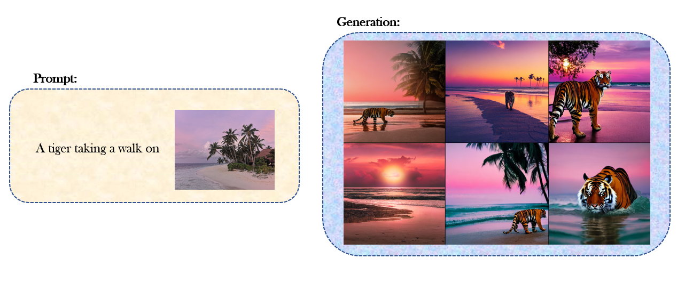
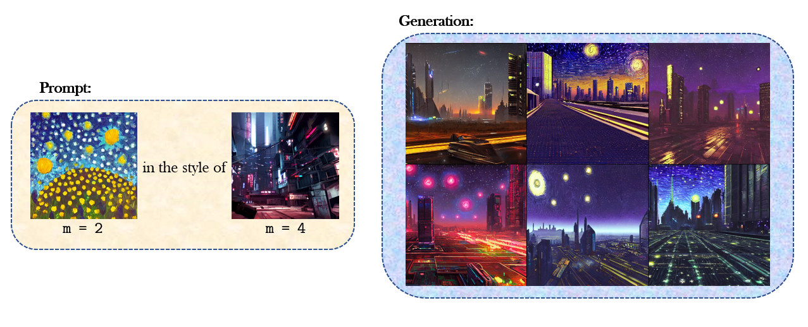
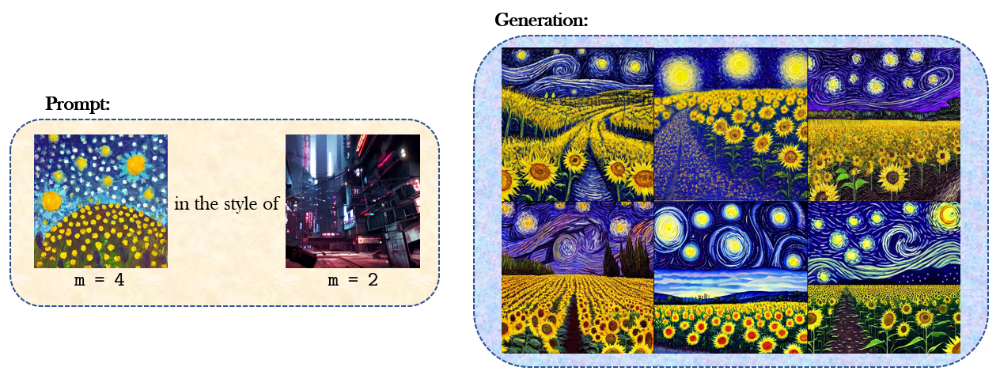
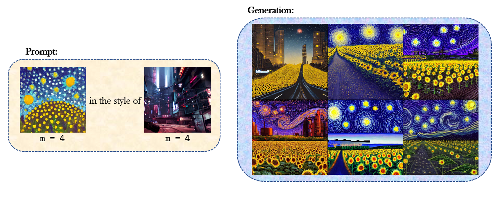

# Multimodal Prompting

This repository presents yet another extension to the Stable Diffusion for image generation: a simple and fast strategy towards prompting Stable Diffusion with an arbitrary composition of image and text tokens.



## Usage

1. Clone this repository. We use a clone of the original [Stable Diffusion repository](https://github.com/CompVis/stable-diffusion/). Before proceeding to the next steps, make sure to follow the instructions to set up text-to-image generation inside the `stable-diffusion` folder by following the steps from their repository. Note that this includes downloading their model into the appropriate place inside `stable-diffusion` and installing the requirements of `stable-diffusion`.

2. This repository ships with the n-gram prompts data inside `data`. Additionally, the preprocessed CLIP embeddings of these prompts need to be downloaded into `data` from [here]().

3. Design a multimodal prompt by replacing images with `[img]` token. For example, the prompt in the figure above is input as `prompt="A tiger taking a walk on [img]`".

4. Let the comma separated paths to all images in the prompt be `image_paths`. Each image can optionally be assigned absolute weights ideally in the integer range 1-10. Let the comma separated weights be `image_weights`.

5. Run the following command:
```bash
python mp2img.py \
    --prompt $prompt \
    --plms \
    --prompt-images $image_paths \
    --image-weights $image_weights
```

## More Results





